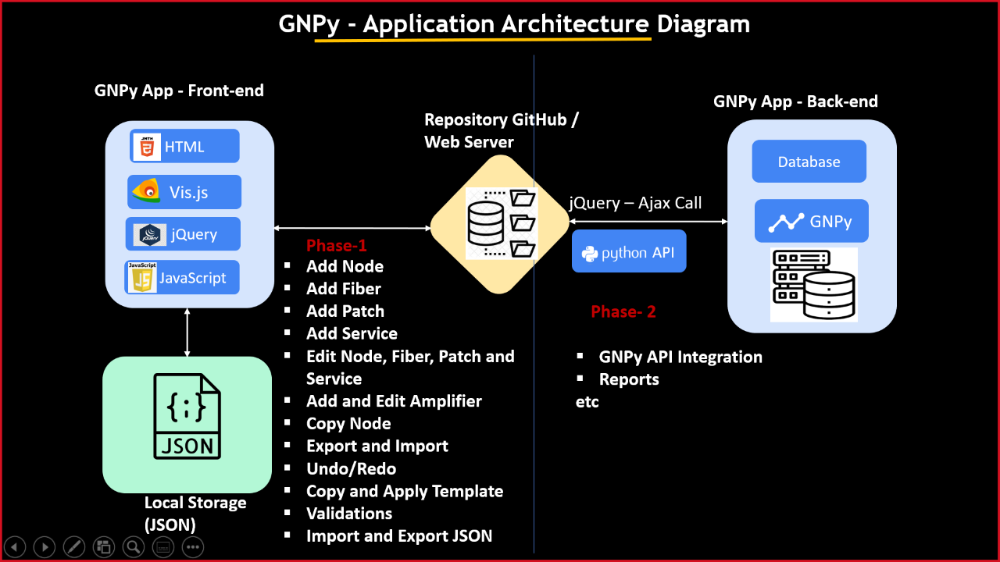

#### <ins>GNPy Tool UI/UX</ins>

**Technologies:**

**Front-End : HTML**

**Client-Script : Javascript and Jquery**

**CSS : Bootstrap**

**<ins>Scope:</ins>**

The main motivation behind this document is to provide the requirements of a GUI framework for the GNPy planning tool. GNPy is an open-source multi-vendor tool for optical network planning. The tool is in active development and with it, operators will no longer have to depend on their suppliers to plan routes and network capacity but will have an independent way to lay out their requirements and simulate network conditions. Having a user-friendly GUI framework is key for the larger adoption of the tool in building optical networks. The planning tool considers certain inputs from the users – network topology, fiber details, traffic matrix, specific network constraints pertaining to both node and span and generates an output which determines the structure of the node (ROADM, OADM or Amplifier), optical results (GSNR, Power budget, linear and non-linear impairments. The software can be offline (PC/MAC based) or can be web-based similar to https://gnpy.app/ without user credentials. SW must be BSD license according to TIP-PSE/GNPy charter. 

**<ins>Software Architecture Diagram:</ins>**

**<ins>Js libraries:</ins>**

**<ins>Vis.js (Network):</ins>**

A network is a visualization to display networks of networks consisting of nodes and edges. The visualization is easy to use and supports custom shapes, styles, colors, sizes, images, and more. The network visualization works smoothly on any modern browser for up to a few thousand nodes and edges. To handle a larger number of nodes, the Network has clustering support. The network uses HTML canvas for rendering.  

**<ins>Alea.js:</ins>**

Alea library is a pseudo-random number generator (PRNG). 

**<ins>ExampleUtil.js:</ins>**

This library describes how to create some random nodes and fiber/patch/service. 

**<ins>Mynetwork.js:</ins>**

The mynetwork library file describes how to initialize the network area using vis.js and defines common functionalities of network components. 

**<ins>Node.js:</ins>**

The node can be defined as the connection point of "ROADM, Attenuator, Transceiver, Amplifier, and Raman Amplifier" and defines the node manipulations.

**<ins>Fiber.js:</ins>**

The fiber library describes how to add a fiber connection between any 2 nodes by dragging from source node to destination and defines the fiber manipulation. 

**<ins>Patch.js:</ins>**

The patch library describes how to add a patch connection between any 2 nodes by dragging from source node to destination and defines the patch manipulation. 

**<ins>Service.js:</ins>**

The Service is also the same as the connectivity path between 2 transceiver nodes. This library file defines service manipulation. 

**<ins>Constraints.js:</ins>**

The constraints library is a list of rules for components. It is defining the network topology validation. 

**<ins>Validation.js:</ins>**

The Validations library currently describes the validation of component name, length, and type. 

**<ins>Main.js:</ins>**

The main.js library describes UI actions. like show/hide and update the HTML element with style based on user interaction.

**<ins>Filesaver.js:</ins>**

Filesaver.js is the solution to saving files on the client-side and is perfect for web apps that generate files on the client. 

**<ins>Html2Canvas.js:</ins>**

The library allows taking "screenshots" of webpages or parts of them, directly on the user’s browser. The screenshot is based on the DOM and as such may not be 100% accurate to the real representation as it does not make an actual screenshot, but builds the screenshot based on the information available on the page. 

**<ins>Taffy.js:</ins>**

The library provides powerful in-memory database capabilities to both browser and server applications. this stores data in JSON format. 

**<ins>Bootstrap.js:</ins>**

Bootstrap is a free front-end framework for faster and easier web development. Bootstrap includes HTML and CSS-based design templates for typography, forms, buttons, tables, navigation, modals, image carousels, and many others, as well as optional JavaScript plugins. 

**<ins>Jquery.js:</ins>**

jQuery is a fast, small, and feature-rich JavaScript library. It makes things like HTML document traversal and manipulation, event handling, animation, and Ajax much simpler with an easy-to-use API that works across a multitude of browsers. 

**<ins>Lodash.js:</ins>**

Lodash helps programmers write more concisely and easier to maintain JavaScript code. Lodash contains tools to simplify programming with strings, numbers, arrays, functions, and objects. By convention, the Lodash module is mapped to the underscore character 

**<ins>Popper.js:</ins>**

A library used to manage poppers in web applications. Popper. js is a positioning engine, its purpose is to calculate the position of an element to make it possible to position it near a given reference element. 

**<ins>JSON:</ins>**

**<ins>Configuration Data.json:</ins>**

This JSON describes the data configuration of network components. 

**<ins>Style Data.json:</ins>**

This JSON describes the style configuration of network components. 